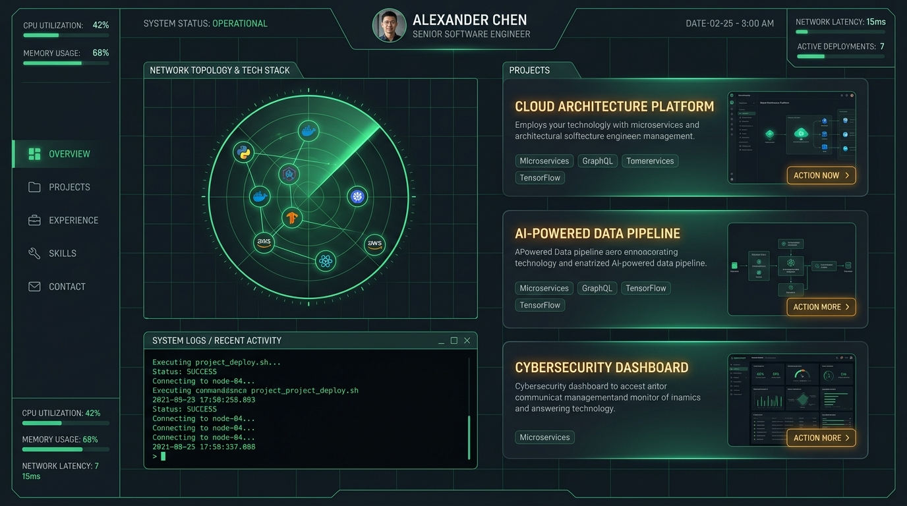
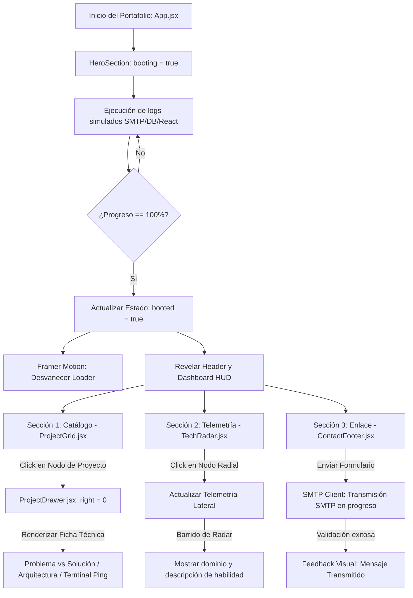

# Miguel Lagunes | Software Engineering Portfolio

[](https://react.dev)
[](https://tailwindcss.com)
[](https://www.framer.com/motion/)
[](https://vite.dev)

Portafolio profesional de desarrollo web para **Miguel Lagunes**, diseñado con una estética inmersiva de **Centro de Mando (Enterprise Tech / Cyber-Dashboard)**. Esta plataforma presenta un catálogo detallado de proyectos de ingeniería, automatización y bases de datos relacionales, incorporando una consola interactiva de booteo y telemetría de habilidades en tiempo real.

---

## Previsualización de la Interfaz



---

## Arquitectura del Sistema y Flujo de Interacciones

El portafolio opera como una aplicación de una sola página (SPA) reactiva con un ciclo de vida estructurado en estados de consola. A continuación se ilustra el flujo lógico de interacción del sistema:



---

## Características Clave

* **Secuencia de Booteo Interactiva:** El portafolio simula la inicialización de módulos de hardware, bases de datos PostgreSQL y workers de Python antes de dar acceso a la consola.
* **Radar Tecnológico HUD:** Representación interactiva del stack tecnológico (React, Python, PostgreSQL, Git, Optimización de Hardware) simulando una pantalla de radar militar con círculos concéntricos de nivel de dominio.
* **Fichas Técnicas Expandibles:** Drawer lateral animado para cada uno de los 9 proyectos del catálogo, detallando arquitectura modular y cuadros comparativos de *Problema vs. Solución*.
* **Cliente SMTP Simulado:** Formulario de contacto integrado con feedback de logs interactivos al enviar mensajes.
* **Estilo Visual Premium:** Combinación de glassmorphism, fondos en cuadrícula neon, scanlines retro y una paleta de color oscura profunda enriquecida con verde esmeralda y acentos ámbar.

---

## Estructura de Directorios

```bash
├── public/
│   ├── favicon.svg          # Favicon temático hexagonal con prompt
│   └── icons.svg            # Recursos y sprites de iconos
├── src/
│   ├── assets/              # Imágenes y vistas previas
│   ├── components/          # Componentes modulares UI
│   │   ├── ContactFooter.jsx
│   │   ├── HeroSection.jsx
│   │   ├── ProjectDrawer.jsx
│   │   ├── ProjectGrid.jsx
│   │   └── TechRadar.jsx
│   ├── data/
│   │   └── data.js          # Estructura centralizada de datos (9 Proyectos y Stack)
│   ├── App.jsx              # Orquestador del Dashboard y estados globales
│   ├── index.css            # Estilos de Tailwind v4 y clases personalizadas
│   └── main.jsx             # Punto de entrada de React
├── index.html               # Carga de fuentes (Outfit, Inter) y SEO Tags
├── package.json             # Dependencias del proyecto
└── vite.config.js           # Integración del plugin oficial Tailwind CSS v4
```

---

## Instalación y Desarrollo Local

### 1. Clonar el repositorio
```bash
git clone <URL_DE_TU_REPOSITORIO>
cd Portafolio_malz
```

### 2. Instalar dependencias
```bash
npm install
```

### 3. Levantar servidor de desarrollo
```bash
npm run dev
```
*Abre tu navegador en http://localhost:5173 para ver la interfaz interactiva.*

### 4. Compilar para producción
```bash
npm run build
```
*El compilado optimizado se generará en la carpeta dist/.*

---

## Despliegue en Vercel

Este proyecto está optimizado para ser desplegado en **Vercel** de manera directa en pocos pasos:

### Opción A: Integración Continua (Recomendada)
1. Ve al panel de control de Vercel (https://vercel.com).
2. Haz clic en **New Project** y selecciona el repositorio de GitHub de este proyecto.
3. Asegúrate de configurar los siguientes parámetros de compilación (Vercel los detecta automáticamente al identificar Vite):
   * **Framework Preset:** Vite
   * **Build Command:** npm run build
   * **Output Directory:** dist
4. Haz clic en **Deploy**. Cada vez que hagas push a la rama main, Vercel actualizará tu sitio automáticamente.

### Opción B: Despliegue desde la Consola (Vercel CLI)
Si prefieres desplegar directamente desde tu terminal local:
```bash
# Instalar CLI de vercel si no lo tienes
npm install -g vercel

# Ejecutar el despliegue
vercel
```
Sigue las instrucciones interactivas de la terminal para vincular y publicar tu portafolio en segundos.
