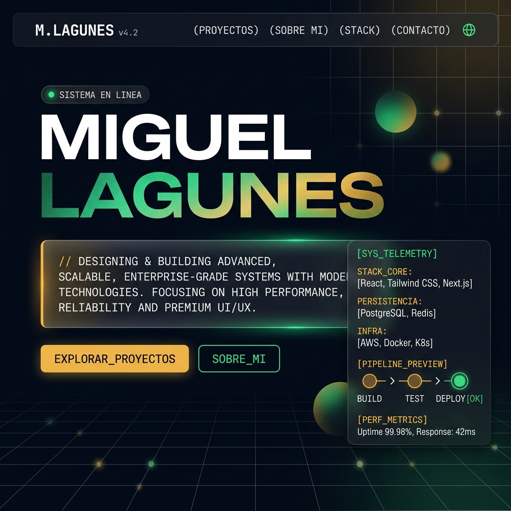
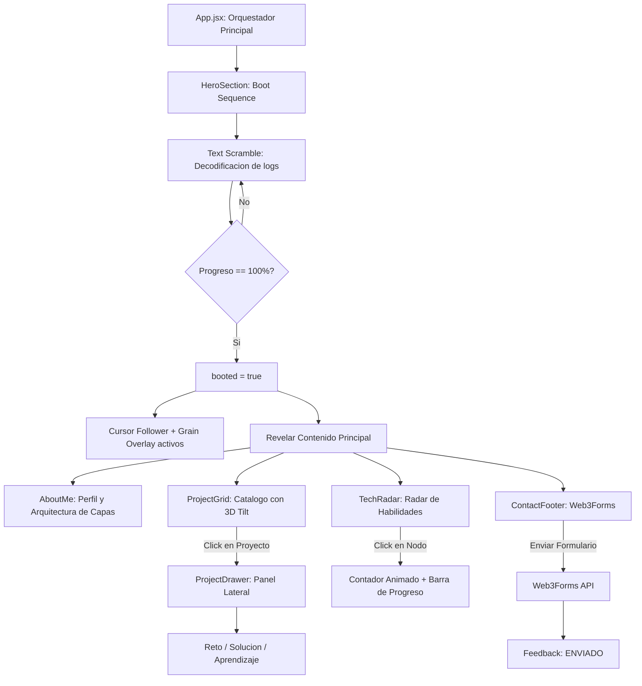

# Miguel Lagunes | Junior Full-Stack Developer Portfolio

[](https://react.dev)
[](https://tailwindcss.com)
[](https://www.framer.com/motion/)
[](https://vite.dev)

Portafolio profesional de **Miguel Lagunes**, estudiante de Ingenieria de Software y Desarrollador Junior Full-Stack. Construido con una estetica inmersiva de **Centro de Mando Premium** que combina animaciones cinematograficas, micro-interacciones avanzadas y un sistema de diseno unico.

---

## Previsualizacion de la Interfaz



---

## Arquitectura del Sistema

El portafolio opera como una SPA reactiva con un ciclo de vida estructurado en estados de consola, animaciones de alto rendimiento y hooks personalizados.



---

## Caracteristicas Clave

### Animaciones Premium
- **Staggered Letter Animation:** Cada letra del nombre anima individualmente con rebote 3D y efecto spring.
- **Text Scramble / Decode:** Los textos se descifran caracter por caracter con caracteres aleatorios intermedios, estilo decodificacion.
- **Cursor Follower Global:** Punto luminoso con efecto spring que sigue al mouse en toda la pagina.
- **Film Grain Overlay:** Textura cinematografica sutil animada sobre toda la interfaz.
- **Gradient Mesh Background:** Fondo vivo con gradientes que se mueven organicamente.

### Micro-interacciones
- **Botones Magneticos:** Los CTA se desplazan sutilmente hacia la posicion del cursor con efecto de gravedad.
- **3D Tilt en Tarjetas:** Las tarjetas de proyectos se inclinan en perspectiva 3D siguiendo la posicion del mouse.
- **Cursor Spotlight:** Punto de luz que sigue al cursor sobre las tarjetas de proyecto.
- **Scroll Reveal Staggered:** Secciones que se revelan progresivamente con animaciones escalonadas.
- **Contadores Animados:** Los porcentajes de skills cuentan desde 0 hasta su valor final.

### Diseno Visual
- **Tipografia Premium:** Space Grotesk (headings), JetBrains Mono (codigo/terminal), Inter (cuerpo).
- **Text Shimmer:** Efecto de brillo animado tipo holograma en el apellido.
- **Glassmorphism:** Paneles con transparencia, blur y bordes sutiles.
- **Animated Border Gradient:** Bordes con gradiente conico que rota continuamente.
- **Radar Sonar:** Visualizacion interactiva del stack con barrido de radar animado y pulsos concentricos.

### Funcionalidad
- **4 Proyectos Core:** CuadraPro, ReqLens, Turnos-Medico, StakeFlow con fichas expandibles de Reto/Solucion/Aprendizaje.
- **Formulario de Contacto:** Integrado con Web3Forms para envio directo al correo.
- **Responsive Design:** Optimizado para desktop, tablet y movil con menu hamburguesa.

---

## Hooks Personalizados

| Hook | Descripcion |
|------|-------------|
| `useTextScramble` | Decodifica texto caracter por caracter con caracteres aleatorios intermedios |
| `useMagnetic` | Detecta posicion del cursor y genera desplazamiento magnetico en el elemento |
| `useTilt` | Inclinacion 3D (perspective + rotateX/rotateY) basada en posicion del mouse |

---

## Estructura de Directorios

```bash
├── public/
│   └── favicon.svg
├── src/
│   ├── assets/
│   │   └── portfolio_preview.png
│   ├── components/
│   │   ├── AboutMe.jsx
│   │   ├── ContactFooter.jsx
│   │   ├── HeroSection.jsx
│   │   ├── ProjectDrawer.jsx
│   │   ├── ProjectGrid.jsx
│   │   └── TechRadar.jsx
│   ├── data/
│   │   └── data.js
│   ├── hooks/
│   │   ├── useMagnetic.js
│   │   ├── useTextScramble.js
│   │   └── useTilt.js
│   ├── App.jsx
│   ├── index.css
│   └── main.jsx
├── index.html
├── package.json
└── vite.config.js
```

---

## Instalacion y Desarrollo Local

### 1. Clonar el repositorio
```bash
git clone <URL_DE_TU_REPOSITORIO>
cd Portafolio
```

### 2. Instalar dependencias
```bash
npm install
```

### 3. Levantar servidor de desarrollo
```bash
npm run dev
```
Abre tu navegador en http://localhost:5173 para ver la interfaz.

### 4. Compilar para produccion
```bash
npm run build
```
El compilado optimizado se generara en la carpeta `dist/`.

---

## Despliegue en Vercel

### Opcion A: Integracion Continua (Recomendada)
1. Ve al panel de control de Vercel (https://vercel.com).
2. Haz clic en **New Project** y selecciona el repositorio de GitHub.
3. Configura los parametros de compilacion:
   - **Framework Preset:** Vite
   - **Build Command:** `npm run build`
   - **Output Directory:** `dist`
4. Haz clic en **Deploy**. Cada push a `main` actualizara el sitio automaticamente.

### Opcion B: Vercel CLI
```bash
npm install -g vercel
vercel
```

---

## Stack Tecnologico

| Capa | Tecnologias |
|------|-------------|
| Frontend | React 19, Tailwind CSS v4, Framer Motion v12 |
| Build | Vite v8 |
| Formulario | Web3Forms API |
| Tipografia | Space Grotesk, JetBrains Mono, Inter (Google Fonts) |
| Despliegue | Vercel |
